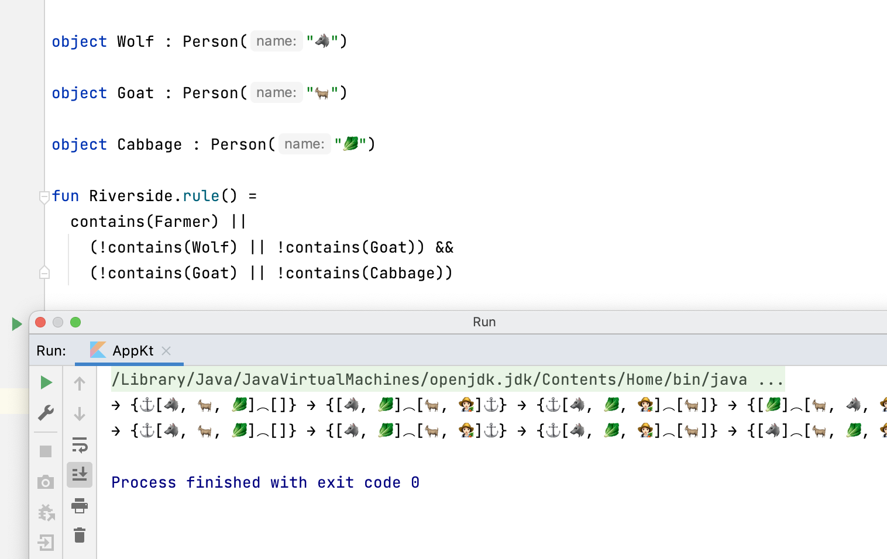

## River crossing puzzle



Domain-specific language to
solve [river crossing puzzle](https://en.wikipedia.org/wiki/River_crossing_puzzle) problem.

### Build

```shell
./gradlew clean test shadowJar
```

Self-executable jar will be located in `build/libs`. You
need [jdk 16](https://www.oracle.com/java/technologies/javase-jdk16-downloads.html) installed. To
start application execute command

```shell
java -jar build/libs/*-all.jar
```
